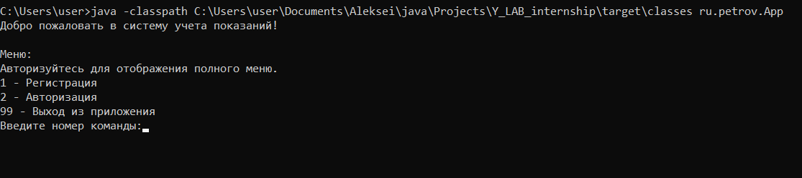

# Система учета показаний
Позволяет регистировать показания приборов учета.

Данные для авторизации:

login: user  
password: 123

login: admin  
password: 123

Пункты меню отображаются в соответсвии с правами пользователя.

Показания можно подавать один раз в месяц.

Ранее поданые показания редактировать запрещено.

Последние поданые показания считаются актуальными.

Пользователь может видеть только свои показания, администратор может видеть показания всех пользователей.

Возможности:

- регистрация пользователя (Любой пользователь)
- авторизация пользователя  (Неавторизованный пользователь)
- просмотр существующих типов показаний (Автозированный пользователь)
- добавление типов показаний (Адмнистратор)
- получение актуальных показаний счетчиков (Автозированный пользователь)

[//]: # (- реализовать эндпоинт подачи показаний)

[//]: # (- реализовать эндпоинт просмотра показаний за конкретный месяц)

[//]: # (- реализовать эндпоинт просмотра истории подачи показаний)

[//]: # (- реализовать контроль прав пользователя)

[//]: # (- Аудит действий пользователя &#40;авторизация, завершение работы, подача показаний, получение истории подачи показаний и тд&#41;)
Пример интерфейса неавторизованного пользователя:

